<div align="center">



<a href="https://brianperezlopez.vercel.app">
  
</a>

<p>
  <a href="https://brianperezlopez.vercel.app"></a>
  <a href="https://www.linkedin.com/in/brian-perez-lopez-2948801a0"></a>
  <a href="mailto:brianpl990227@gmail.com"></a>
  <a href="https://t.me/+4aZdHLLxia85Njdh"></a>
</p>


</div>

---

## 👨‍💻 Sobre mí

Soy **ingeniero de software** graduado en la Universidad de Ciencias Informáticas (UCI) y **.NET es mi terreno**. Diseño APIs sólidas con ASP.NET Core, construyo interfaces modernas con Vue, Nuxt, Angular y Blazor, y me obsesiona que el código se entienda hoy y siga siendo fácil de cambiar dentro de un año.

```csharp
public record Developer
{
    public string   Name      => "Brian Pérez López";
    public string   Role      => "Software Engineer · .NET & Full-Stack";
    public string   Base      => "La Habana, Cuba 🇨🇺";

    public string[] Backend   => ["C#", "ASP.NET Core", "Entity Framework", "Go"];
    public string[] Frontend  => ["Vue", "Nuxt", "Angular", "Blazor", "TypeScript"];
    public string[] Practices => ["Clean Architecture", "SOLID", "TDD", "CI/CD"];

    public string   Motto     => "Si no tiene tests, no está terminado.";
}
```

- 🃏 **Ahora mismo** construyo [**Continental**](https://github.com/brianpl990227/Continental): un juego de cartas multiplataforma en **.NET 10** donde *el móvil de quien crea la sala es el servidor*
- 🔭 **Explorando** microservicios, arquitecturas orientadas a eventos y Kubernetes
- 💬 **Pregúntame sobre** .NET, Clean Architecture, testing con xUnit o Vue/Nuxt

## 🧰 Stack

<table>
  <tr>
    <td align="center" width="140"><b>Backend</b></td>
    <td></td>
  </tr>
  <tr>
    <td align="center"><b>Frontend</b></td>
    <td></td>
  </tr>
  <tr>
    <td align="center"><b>Datos</b></td>
    <td>
      
      
    </td>
  </tr>
  <tr>
    <td align="center"><b>DevOps &amp; tools</b></td>
    <td></td>
  </tr>
</table>

## 🚀 Proyectos destacados

<table>
  <tr>
    <td width="50%" valign="top">
      <h3>🃏 <a href="https://github.com/brianpl990227/Continental">Continental</a></h3>
      Juego de cartas para <b>Android, Windows y navegador</b>. Quien crea la sala levanta un servidor web en su propio dispositivo y el resto se une desde la app… o desde cualquier navegador, sin instalar nada.
      <br /><br />
      <code>.NET 10</code> <code>MAUI</code> <code>GenHTTP</code> <code>C#</code>
    </td>
    <td width="50%" valign="top">
      <h3>🏛️ <a href="https://github.com/brianpl990227/CleanArchitectureTemplate">Clean Architecture Template</a></h3>
      Plantilla .NET lista para arrancar proyectos con capas bien separadas: entidades, casos de uso, puertos, presentadores, controladores y repositorio con EF Core.
      <br /><br />
      <code>ASP.NET Core</code> <code>EF Core</code> <code>IoC</code> <code>SOLID</code>
    </td>
  </tr>
  <tr>
    <td valign="top">
      <h3>🧪 <a href="https://github.com/brianpl990227/Unit-Test-XUnit">Unit Testing con xUnit</a></h3>
      Ejemplos prácticos de pruebas unitarias: patrones, buenas prácticas y cómo escribir tests que de verdad protegen el código.
      <br /><br />
      <code>xUnit</code> <code>TDD</code> <code>C#</code>
    </td>
    <td valign="top">
      <h3>👥 <a href="https://github.com/brianpl990227/dotnetgroup">DotNet Group</a></h3>
      Proyecto colaborativo para aprender C# y .NET en equipo, compartiendo conocimiento y buenas prácticas.
      <br /><br />
      <code>C#</code> <code>.NET</code> <code>Comunidad</code>
    </td>
  </tr>
  <tr>
    <td valign="top">
      <h3>⚡ <a href="https://github.com/brianpl990227/go-fiber">Go Fiber API</a></h3>
      API REST en Go con el framework Fiber, pensada para rendimiento y simplicidad.
      <br /><br />
      <code>Go</code> <code>Fiber</code> <code>REST</code>
    </td>
    <td valign="top">
      <h3>🌐 <a href="https://github.com/Desarrolladores-Net">Desarrolladores .Net</a></h3>
      Comunidad de desarrolladores centrada en .NET y JavaScript: proyectos abiertos, aprendizaje y colaboración.
      <br /><br />
      <code>.NET</code> <code>JavaScript</code> <code>Open Source</code>
    </td>
  </tr>
</table>

## 📊 En números

<div align="center">

<picture>
  <source media="(prefers-color-scheme: dark)" srcset="https://raw.githubusercontent.com/brianpl990227/brianpl990227/main/profile-summary-card-output/github_dark/0-profile-details.svg" />
  
</picture>

<picture>
  <source media="(prefers-color-scheme: dark)" srcset="https://raw.githubusercontent.com/brianpl990227/brianpl990227/main/profile-summary-card-output/github_dark/1-repos-per-language.svg" />
  
</picture>
<picture>
  <source media="(prefers-color-scheme: dark)" srcset="https://raw.githubusercontent.com/brianpl990227/brianpl990227/main/profile-summary-card-output/github_dark/2-most-commit-language.svg" />
  
</picture>

<picture>
  <source media="(prefers-color-scheme: dark)" srcset="https://streak-stats.demolab.com?user=brianpl990227&theme=github-dark-blue&hide_border=true&background=00000000&locale=es" />
  
</picture>

<picture>
  <source media="(prefers-color-scheme: dark)" srcset="https://raw.githubusercontent.com/brianpl990227/brianpl990227/output/github-snake-dark.svg" />
  
</picture>

</div>

## 💬 ¿Hablamos de código?

Ahora mismo no busco trabajo, estoy muy a gusto donde estoy. Pero una buena charla sobre .NET, arquitectura o algún proyecto open source siempre me apetece.

<div align="center">

<a href="https://brianperezlopez.vercel.app"></a>
<a href="https://www.linkedin.com/in/brian-perez-lopez-2948801a0"></a>
<a href="mailto:brianpl990227@gmail.com"></a>
<a href="https://t.me/+4aZdHLLxia85Njdh"></a>

</div>
